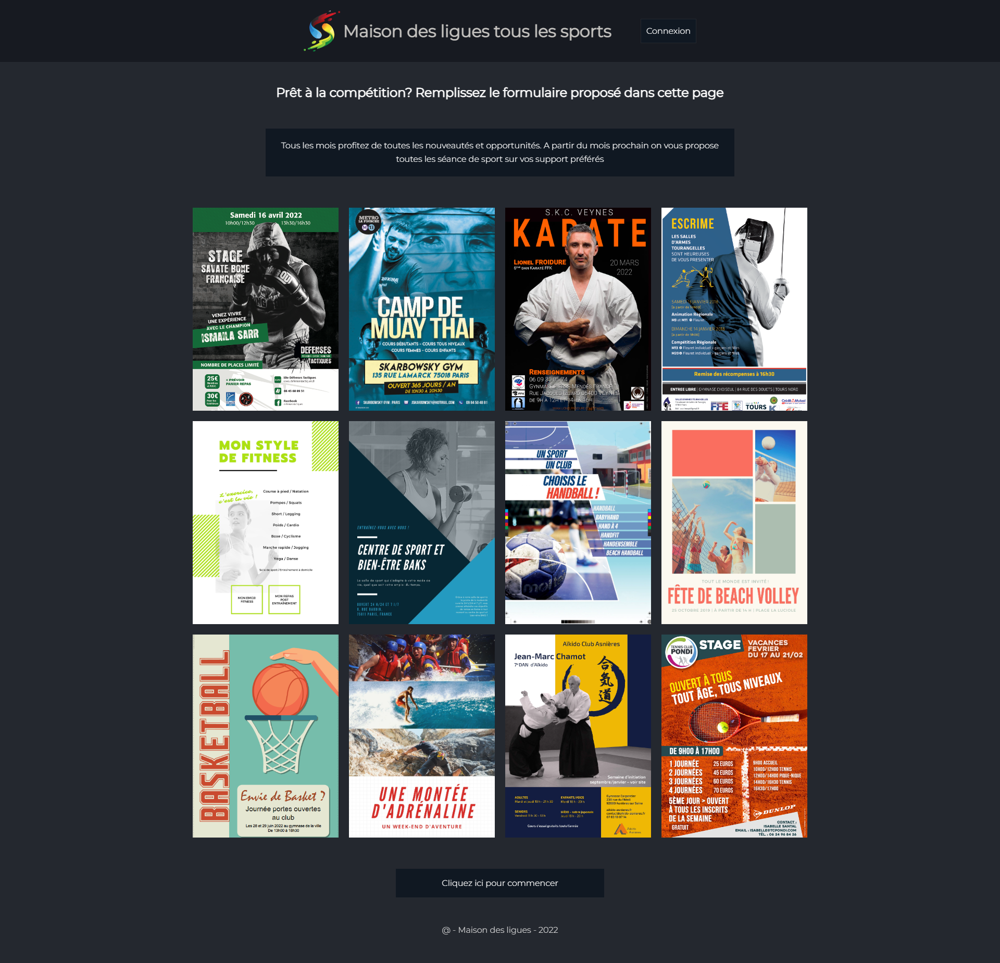
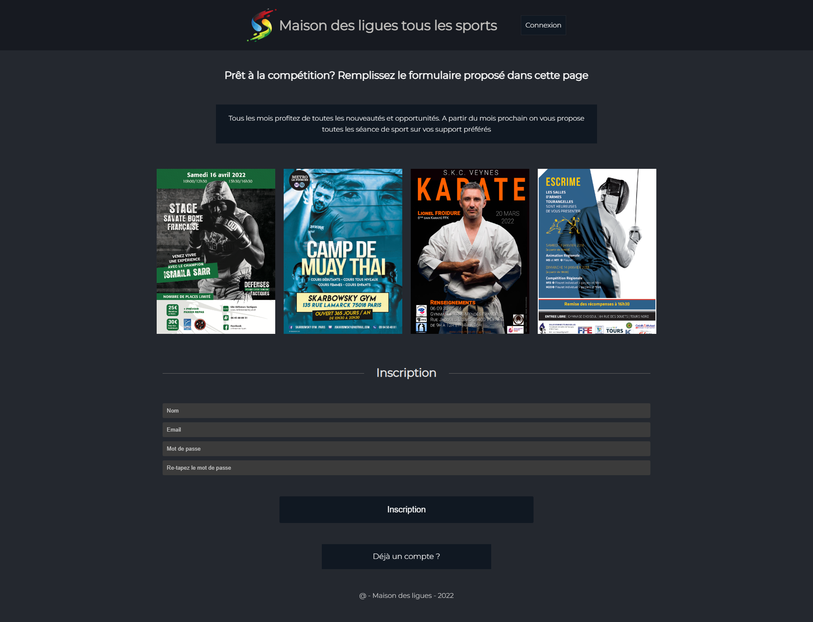
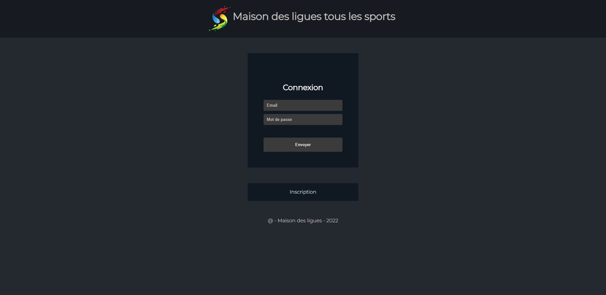
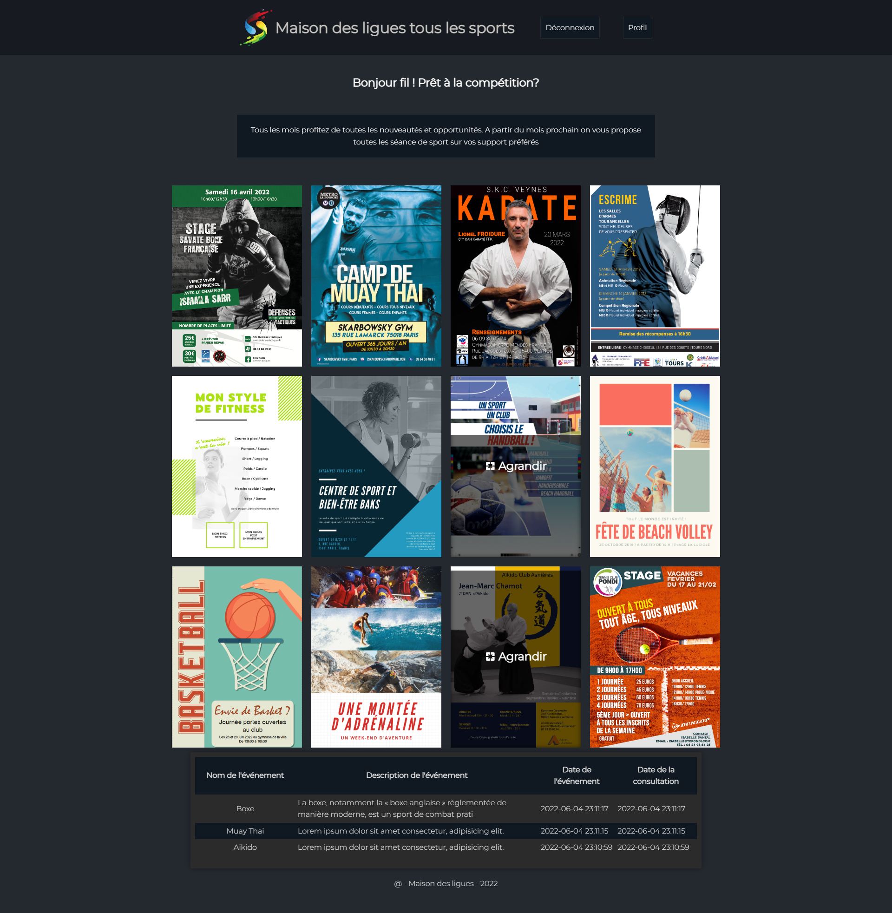
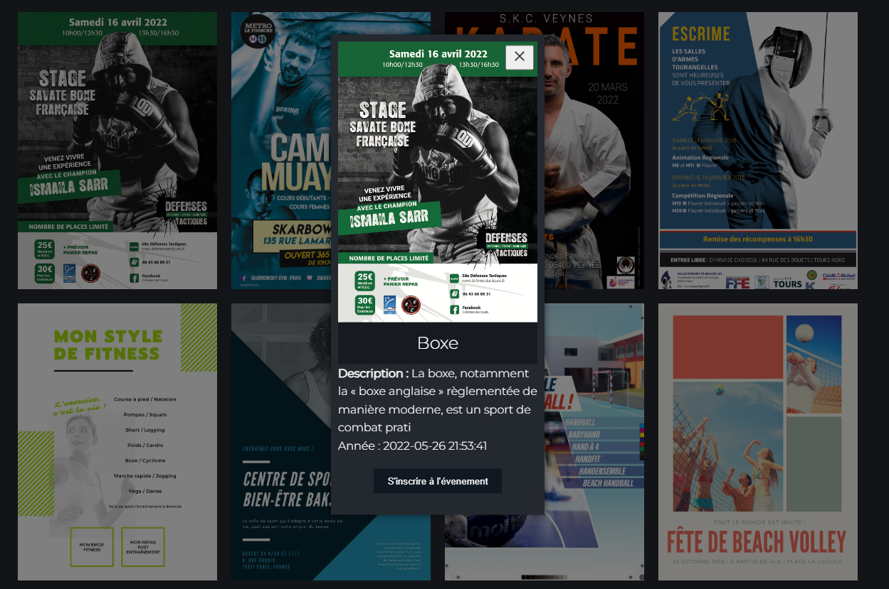
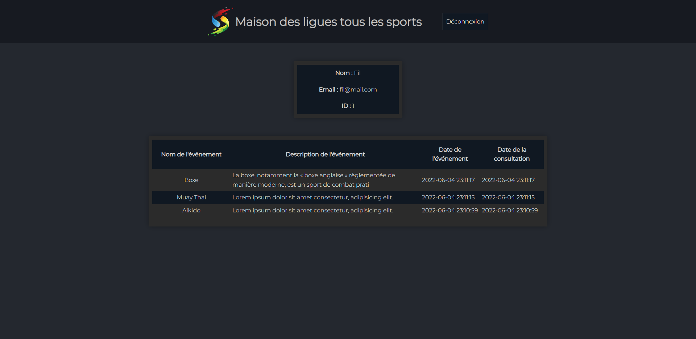
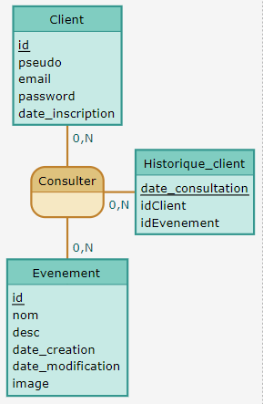

# Projet AP WEB BTS   | BTS SIO SLAM2 |   `Maison des ligues - tous les sports`

## Samuel ATLANI

[Voir la page](https://samalairbien.github.io/Projet_WEB/accueil.html)

## Sommaire :

1. [Introduction](#Introduction)

2. [Fonctionnement](#Fonctionnement)

3. [Annexe_Développeur](#Annexe_Développeur)

# `Introduction`

Cette situation professionnelle est réalisée dans le contexte de la M2L ou Maison des ligues de Lorraine. Une agence nous confie la réalisation d’une page publicitaire pour la Maison de ligues sur le web. La promotion a pour but de conquérir des nouveaux abonné(e)s, en proposant la diffusion de toutes les compétitions sportives.

 

# `Fonctionnement`

Le site web présenté ici a pour fonctionnalités globales la possibilité de s’inscrire et de se connecter en créant une session afin stocker les informations du client sur la base de données. Il est aussi possible, une fois connecté, de s’inscrire à un des événements de sport présenté sur la page, cette inscription sera enregistrée et visible par le client, l’information sera également stockée sur la base de données. Cette interface sera décrite ici sous forme de manuel d'utilisation de la page.

## Documentation utilisateur :

# Accueil

 

En premier lieu, sur la page d’accueil du site, vous aurez accès à la possibilité de vous connecter ou de vous inscrire, soit en cliquant sur “Cliquez ici pour commencer” au bas de la page ou en cliquant sur "Connexion"

# Inscription

# Connexion

Une fois authentifié, l’utilisateur accède à la page suivante :

# L'accueil du membre 

Une fois connecté, vous aurez la possibilité de vous inscrire à un événement en cliquant sur l’image puis en validant le bouton “S’inscrire à l'événement”  
Affichant ainsi un tableau répertoriant toutes vos dernières inscriptions aux évènements du site. 

## Le modale

# Le profil

 

# `Annexe_Développeur`

    

    Client ( id, pseudo, email, password, date_inscription )
    Consulter ( id, date_consultation, id.1 )
    Historique_client ( date_consultation, idClient, idEvenement )
    Evenement ( id, nom, desc, date_creation, date_modification, image )